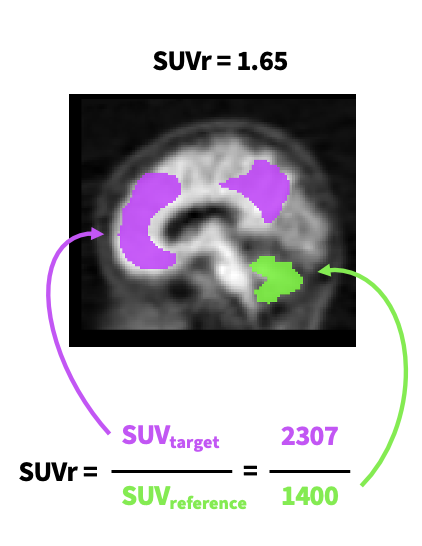
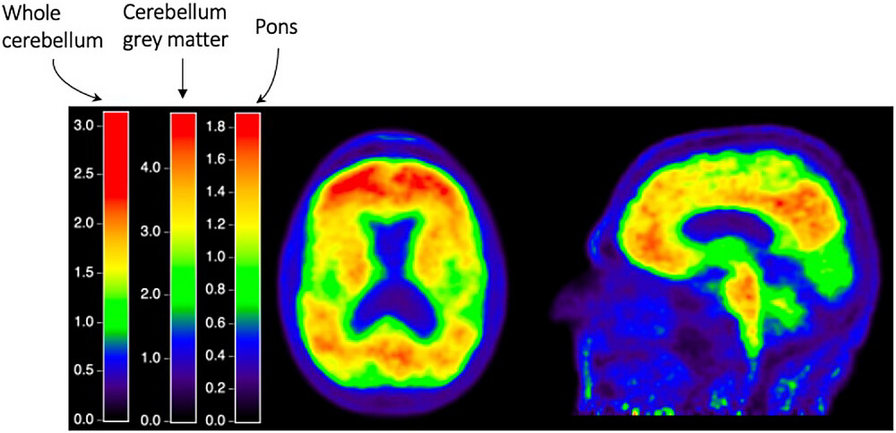
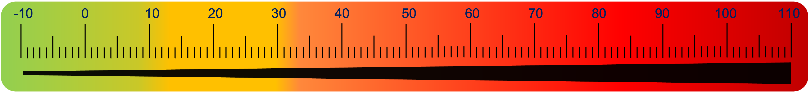

## Why Standardize Amyloid PET Quantification?

The Standardized Uptake Value Ratio (SUVR) is the most common measure of amyloid load.

  

However, SUVR are difficult to interpret, and different tracers (e.g., PiB, Florbetapir, Florbetaben, Flutemetamol, [F-18]NAV4694) and processing pipelines produce different scales. 
SUVR values are dependant on:
- Tracer
- Acquisition time window
- Scanner resolution
- Processing pipeline (e.g. registration software)
- Tartet and Reference region

  

As a result, SUVR variability makes it difficult to:
- Compare amyloid load across tracers
- Compare results across studies and centres
- Pool data from different cohorts
- Define universally accepted cut-offs (e.g. for amyloid positivity)

To address this, the **Centiloid scale (CL)** was proposed by Klunk et al. (2015), with the idea to define a **standardized metric** across tracers and pipeline. The scale has two *anchor* points:

- **0 CL**: Mean amyloid burden in young healthy controls  
- **100 CL**: Mean amyloid burden in mild-to-moderate Alzheimer's disease patients

  

Once mapped to this scale, SUVR values from *any* validated tracer and pipeline can be **converted to Centiloids**, enabling consistent interpretation and comparison in various contexts (see Interpretation tab).

## Key Features of the Centiloid Scale

- 📈 Linear transformation of SUVR  
- 📊 Allows comparison of amyloid loads from multiple tracers and processing methods  
- 🔧 Requires pipeline validation if using custom methods  
- 🔗 Supported by an open-access reference data available via [GAAIN](https://www.gaain.org/centiloid-project)

## Workshop overview:

This app was designed to provide an overview of the Centiloid scale with interactive examples.
The following topics are covered:
- How the Centiloid is defined and calculated  
- How to interpret it
- How to validate your own processing pipeline  
- Provide a database of software with Centiloid

Let’s get started :)

